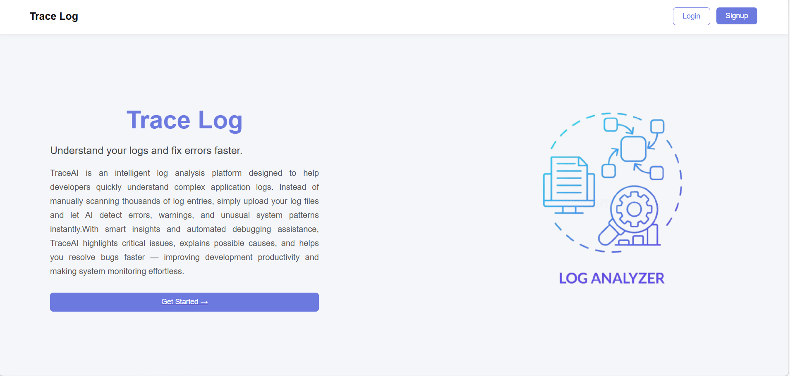
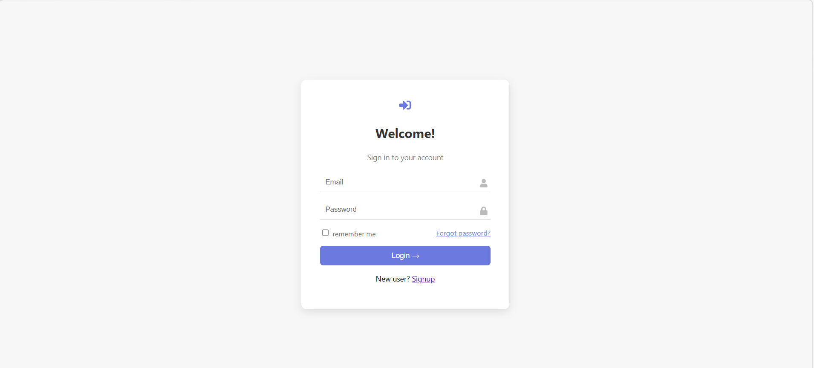
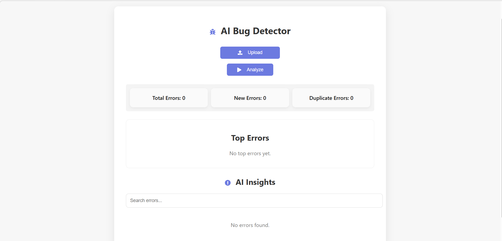
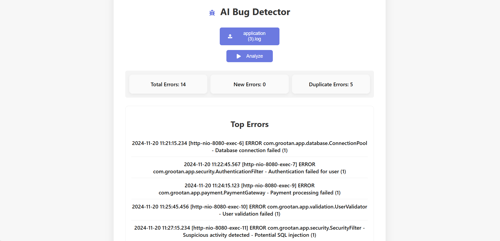

# 🤖 AI Log Analyzer

AI-powered log analysis tool that detects errors from log files and provides possible causes and solutions using AI.
The system analyzes uploaded logs, masks sensitive data, and uses AI to identify root causes and suggest fixes.

---

# 🚀 Features

* 📂 Upload system log files
* 🤖 AI-powered error analysis
* 🔍 Detect root cause of errors
* 💡 Suggest possible fixes
* 🔒 Sensitive data masking (emails, API keys, tokens, database URLs)
* 📊 SQLite caching to reduce repeated AI API calls
* ⚡ Fast log processing
* 🔍 Advanced log filtering and search

---

# 🛠 Tech Stack

## Frontend

* React (Vite)
* CSS
* Axios
* React Router
* React Icons

## Backend

* Node.js
* Express.js
* MongoDB
* Mongoose

## AI Integration

* Groq LLM API

---

# 🏗 System Architecture

User
 ↓
Upload Logs
 ↓
Backend Processing
 ↓
Sensitive Data Masking
 ↓
Search SQLite Cache
 ↓
Existing Error?
 ├─ Yes → Return Cached AI Insight
 └─ No  → Send to Groq AI → Store Result
 ↓
Dashboard Result
---

# 📸 Screenshots

### Landing Page



### Login Page



### Upload Logs



### AI Analysis Result



---

# ⚙ Installation (Manual Setup)

## 1️⃣ Clone the repository

```bash
git clone https://github.com/23ece154/AI-log-analyzer.git
```

---

## 2️⃣ Navigate to project folder

```bash
cd AI-log-analyzer
```

---

## 3️⃣ Install Backend Dependencies

```bash
cd backend
npm install
```

Main backend packages:

* express
* mongoose
* cors
* dotenv
* jsonwebtoken
* bcryptjs
* multer
* axios

---

## 4️⃣ Install Frontend Dependencies

```bash
cd ../frontend
npm install
```

Main frontend packages:

* react
* react-dom
* react-router-dom
* axios
* react-icons

---

## 5️⃣ Setup Environment Variables

Create a `.env` file inside the **backend folder**

Example:

```
PORT=5000
MONGO_URI=your_mongodb_connection
JWT_SECRET=your_jwt_secret
GROQ_API_KEY=your_groq_api_key
```

---

## 6️⃣ Run the Project

### Start Backend

```bash
cd backend
npm start
```

### Start Frontend

```bash
cd frontend
npm run dev
```

Open:

```
http://localhost:5173
```

---

# 🐳 Run with Docker (Recommended)

## 1️⃣ Clone the repository

```bash
git clone https://github.com/23ece154/AI-log-analyzer.git
```

---

## 2️⃣ Navigate to project folder

```bash
cd AI-log-analyzer
```

---

## 3️⃣ Start the containers

```bash
docker compose up --build
```

---

## 4️⃣ Open the application

Frontend

```
http://localhost:5173
```

Backend API

```
http://localhost:5000
```

---

# 📦 Project Structure

```
AI-log-analyzer
│
├── backend
│   ├── controllers
│   ├── routes
│   ├── utils
│   ├── models
│   └── server.js
│
├── frontend
│   ├── src
│   ├── components
│   ├── pages
│   └── styles
│
├── docker-compose.yml
├── README.md
```

---

# 🔮 Future Enhancements

* 🔴 Real-time log monitoring
* 📊 Log analytics dashboard
* 📈 Error trend visualization
* 🔔 Alert system for critical errors
* 📂 Multi-file log analysis
* 🧠 AI chat assistant for logs
* ☁ Cloud log storage support

---

# 👨‍💻 Author

**Sri Karthika**
3rd Year Engineering Student

---

# 🤝 Contributing

Contributions are welcome!
Feel free to fork this repository and submit a pull request.

---

# ⭐ Support

If you like this project, please give it a ⭐ on GitHub!
